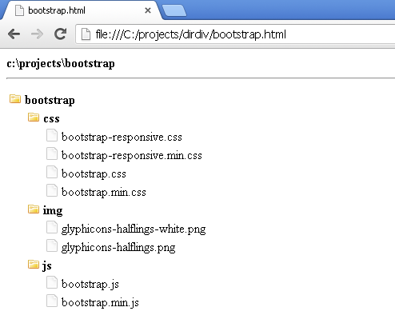

DIRDIV
======

Generate a minimally-styled HTML document of any directory tree right to the console. The perfect tool for displaying
a file/folder structure for online tutorials or print media. Powered by Python.

<h3>Benefits</h3>
* W3C Valid HTML5 output.
* Two-space indenting for pretty, useful HTML output.
* Easily edited internal stylesheet with embedded file and folder icons to get you started.
* Directory tree constructed of nested &lt;ul&gt; elements.
* Output markup right to console or echo to file of your choice.

<h3>Things To Know</h3>
The dirdiv output, rendered in a browser, is not interactive (folders cannot be collapsed/expanded) and there are no limitations on how
far dirdiv will travel.

<h3>Usage</h3>
<pre>
python dirdiv.py c:\projects\bootstrap
</pre>
<pre>
python dirdiv.py c:\projects\bootstrap > bootstrap.html
</pre>

The above command would create an HTML file that would render in the browser looking
something like this:

